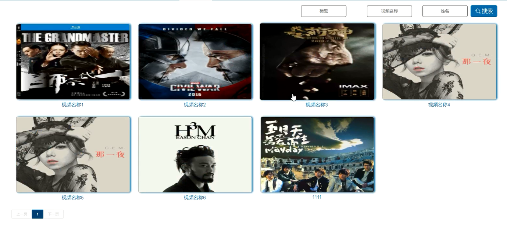
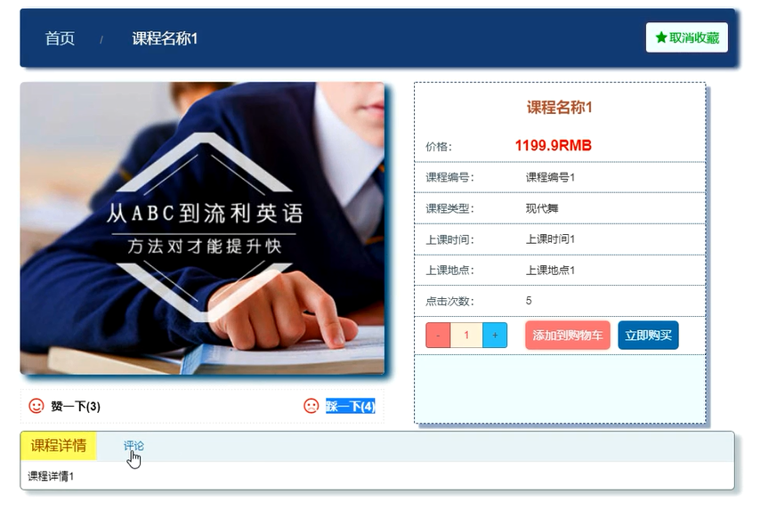
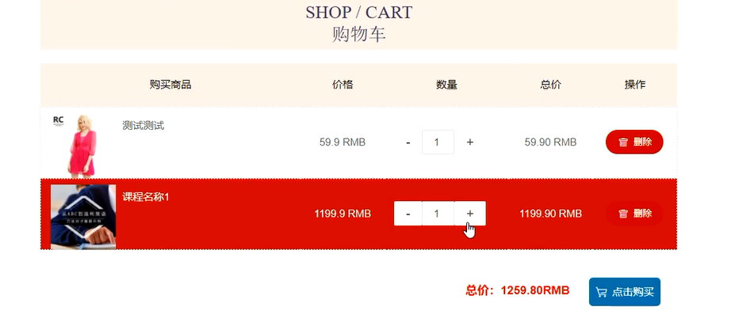
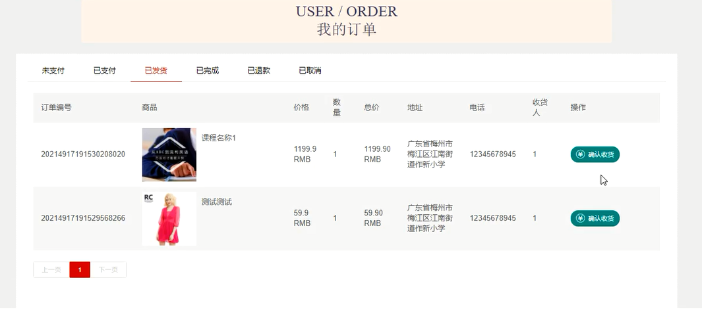
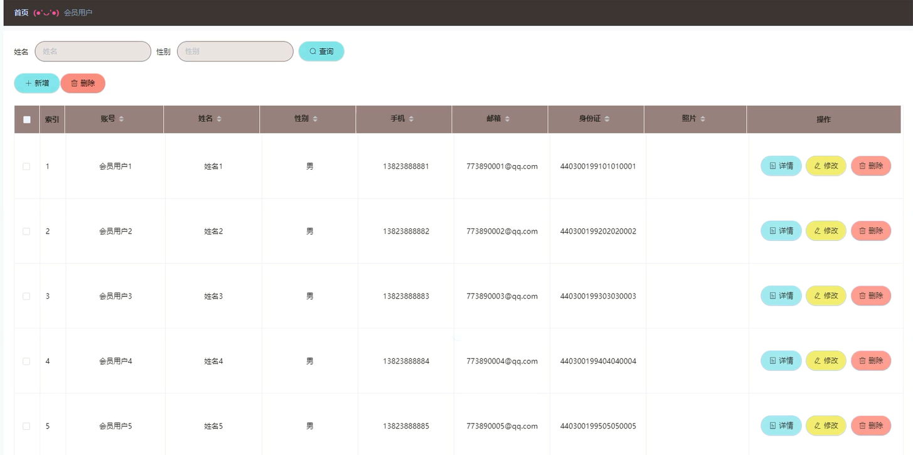
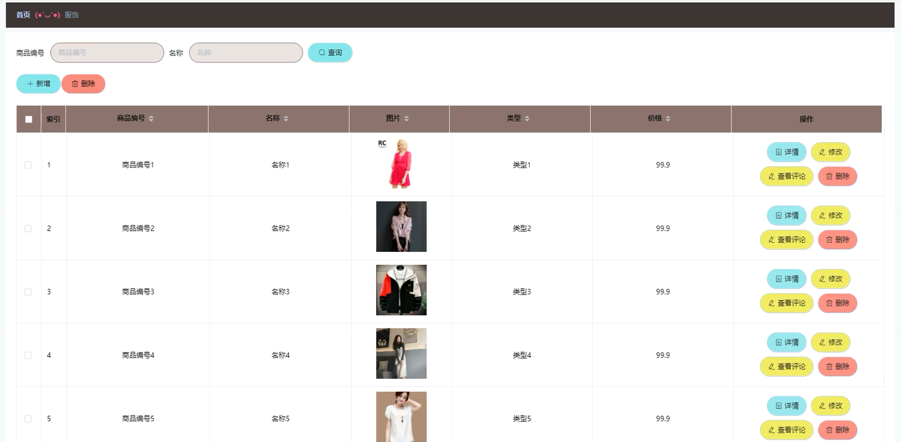
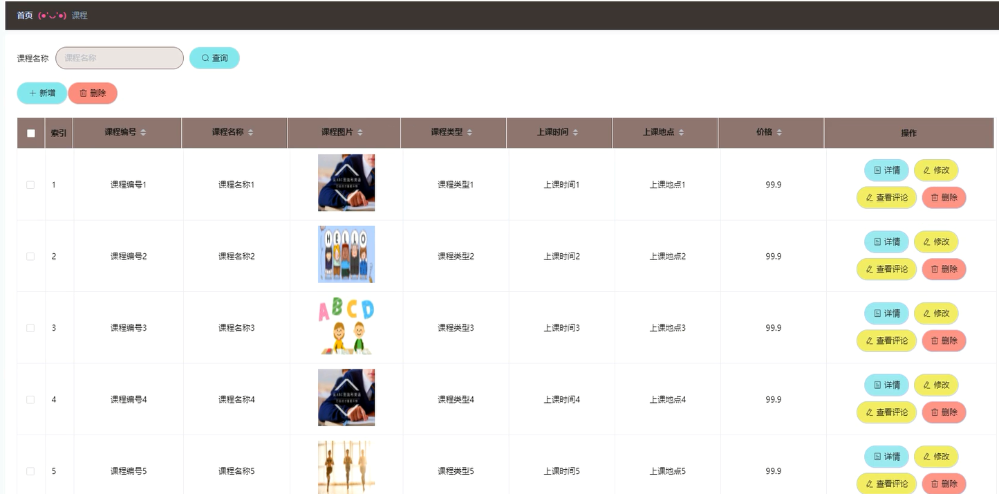

## 基于SpringBoot的古典舞在线交流平台(程序+报告)

- <b>完整代码获取地址：从戎源码网 ([https://armycodes.com/](https://armycodes.com/))</b>
- <b>技术探讨、资料分享，请加QQ群：692619798</b> 
- <b>作者微信：19941326836  QQ：952045282</b> 
- <b>承接计算机毕业设计、Java毕业设计、Python毕业设计、深度学习、机器学习</b>
- <b>选题+开题报告+任务书+程序定制+安装调试+论文+答辩ppt 一条龙服务</b>
- <b>所有选题地址 ([https://github.com/YuLin-Coder/AllProjectCatalog](https://github.com/YuLin-Coder/AllProjectCatalog)) </b>

## 项目介绍
基于SpringBoot的古典舞在线交流平台，系统包含两种角色：用户、管理员，系统分为前台和后台两大模块，主要功能如下：

### 【管理员】:
- 管理员登录界面: 管理员必须通过该界面登录系统后台以进行管理操作。

- 会员用户管理界面: 管理员可以对会员用户的信息进行增删改查操作。

- 服饰管理界面: 管理员可以对服饰信息进行增删改查操作。

- 课程管理界面: 管理员可以对课程信息进行增删改查操作。

### 【用户】:
- 系统主界面: 用户进入系统后可以查看首页、服饰、课程、视频和论坛交流等内容。

- 用户注册界面: 新用户可以通过该界面进行注册操作。

- 论坛交流界面: 用户可以在论坛交流界面查看已有的交流信息，并选择查看详情。

- 课程详情界面: 用户可以查看课程的详细信息，登录后可以将课程加入购物车或进行购买操作。

- 购物车界面: 用户可以在购物车界面查看和管理购物车中的商品，包括修改数量、删除商品或提交订单。

- 我的订单界面: 用户可以查看个人订单的信息。

## 项目技术
- 编程语言：Java
- 数据库：MySQL
- 项目管理工具：Maven
- 前端技术：HTML、CSS、JavaScript、Jquery、Vue
- 后端技术：Spring、SpringMVC、MyBatis

## 运行环境
- JDK版本：JDK1.8及以上
- 开发工具：IDEA、Ecplise、Myecplise都可以
- 数据库: MySQL5.7及以上
- Maven：maven3.0及以上
- Node：14.14.0及以上

## 运行截图

